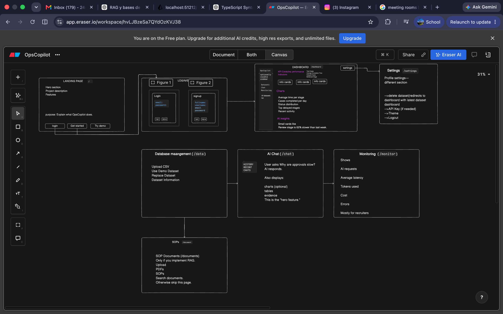

## TECH STACK

**Frontend**

- React + TypeScript (you already know this — your strong suit)
- A charting library: **Recharts** (simplest) or Chart.js — for the dashboard visuals
- Tailwind CSS for fast, clean styling (non-technical-friendly = clean and calm)
- A lightweight state approach is fine; no need for heavy Redux

**Backend**

- **Python for ML related functions or implementations + TS (RESTAPI)**

**Database & data layer**

- **PostgreSQL** — your SQL "truth" store; also lets you use **pgvector** so your relational data and your embeddings live in *one* database (clean, and a nice thing to mention). If Postgres setup feels heavy early on, SQLite is a fine start and you migrate later.
- **pgvector** (Postgres extension) *or* **Chroma** (standalone, dead-simple) for the vector store / RAG
- SQLAlchemy as the ORM (optional but tidy)

**The AI / agent layer** (the heart)

- An LLM API — **GEMINI**; either is fine. Pick one.
- **Native tool-calling / function-calling** from that API — prefer this over a heavy framework so *you* understand the mechanics (interviewers love this). LangChain/LlamaIndex are optional conveniences, not requirements — mention you chose raw tool-use *deliberately*.
- An embeddings model (OpenAI `text-embedding-3-small` or an open one) for RAG
- Your tools, which are just Python functions the LLM can call: `query_database(sql)`, `search_docs(query)`, `compute_metric(name)`

**The data science / analysis bits** (covers the JD's "comfort with data")

- **pandas** for log analysis and computing metrics (cycle time, bottlenecks, throughput)
- **Optional, high-value 1-day add:** one small real ML touch — a simple **anomaly detector** (even `scikit-learn`'s IsolationForest) or a **logistic regression** classifier on the logs — so you can truthfully say "I trained *and evaluated* a model," not just "I called an API." Uses scikit-learn.

**The evaluation & monitoring layer** (your differentiator)

- No fancy tool needed — this is your own code: a JSON/CSV eval set, a scoring script using **LLM-as-Judge** (you prompt the LLM to grade answers), and a results table
- Log every request (latency via Python's `time`, token counts from the API response, quality score) into a small table, and render it on a monitoring page
- Optional: **Langfuse** (free tier) if you want polished tracing — but rolling your own is more impressive and shows you understand *what* to measure

**Deployment**

- **Render** (backend + Postgres in one place, generous free tier, very beginner-friendly) or **Railway**; **Vercel** for the React frontend
- Skip AWS unless you already know it — a working deployed app beats a half-finished AWS setup, and Render maps just as well to their "operate & maintain" theme
- A clean **README** with an architecture diagram and your **QCD (Quality/Cost/Delivery) trade-offs** written out — the JD literally uses that phrase, so use it back at them

**Data itself** (don't overlook this — realistic data sells the whole thing)

- Use a public **event-log / process-mining dataset** (e.g., the well-known BPI Challenge logs) or a support-ticket dataset, so your "enterprise ops" framing is credible rather than toy data
- Plus ~5–10 short fake "SOP" documents you write yourself for the RAG side

## A ROUGH FLOWCHART OF HOW MY WEBSITE SHOULD LOOK AND DISPLAY THE FUNCTIONALITIES
